 

 

 

## 〔 01 〕&nbsp; Qui je suis

**Dev & ingénieur infra · 27 ans · Valenciennes, FR**

Je fais le boulot de bout en bout. Composant frontend, API, pipeline CI, infra Terraform, déploiement — sans passer la main, sans ouvrir un ticket pour que quelqu'un d'autre s'en occupe.

J'ai appris seul, sur le tas, en cassant des trucs et en les réparant. Ça se voit dans mes commits.

| | |
|:--|:--|
| 🏗️ **Comment je bosse** | IaC · CI-first · zero handoff |
| 🌍 **Langues** | Français · Anglais |
| 📍 **Localisation** | Valenciennes — remote possible |
| 💼 **Dispo** | **Ouvert aux opportunités** · [me contacter](mailto:gfavreau.wrprojects@gmail.com) |

 

**En ce moment**

<!-- NOW:START -->
🔨 Refonte du profil GitHub — workflows, automatisation
🌱 Kubernetes — clusters perso en cours
📖 *The DevOps Handbook*
<!-- NOW:END -->

 

## 〔 02 〕&nbsp; Stack

**Frontend**

**Backend & Data**

**DevOps & Infra**

## 〔 03 〕&nbsp; Comment je travaille

> *"Toute action répétée manuellement est un bug d'architecture."*

Je ne fais pas la distinction "code" / "infra". Quand j'écris une feature, j'ai déjà le Dockerfile en tête, le step CI qui la valide, et le plan Terraform qui provisionne ce qui manque.

Concrètement :

- `git push` → lint, tests, build Docker, push registry — automatique
- merge sur `main` → `terraform apply`, deploy, DNS — automatique
- en prod → zéro intervention manuelle

Ce README tourne sur ce modèle : metrics régénérées chaque matin, URLs vérifiées chaque lundi, section "en ce moment" injectée par workflow à chaque commit sur `NOW.md`.

## 〔 04 〕&nbsp; Ce que j'apporte

| Contexte | Ce que tu gagnes |
|:--|:--|
| 🏢 **Startup / Scale-up** | Quelqu'un qui code ET déploie — pas besoin d'un DevOps en plus |
| 🏛️ **ESN / Mission** | Profil polyvalent, autonome, capable de tenir un sujet de A à Z |
| 💼 **Freelance** | Un seul interlocuteur pour tout : front, back, infra, CI/CD |
| 👨‍💻 **Équipe tech** | Un pair qui review avec le contexte prod en tête, pas juste le code |

## 〔 05 〕&nbsp; Stats & Activité

 

<table><tr>
<td align="center">

</td>
<td align="center">

</td>
</tr></table>

 

<b>Métriques détaillées</b> — activité, issues, achievements

 

 

 

 

## 〔 06 〕&nbsp; On bosse ensemble ?

Dispo pour une mission, un poste, ou un projet freelance. 
Un email suffit.

 

 

---

<a href=".github/workflows/metrics.yml">metrics</a> · quotidien &nbsp;|&nbsp;
<a href=".github/workflows/health-check.yml">health-check</a> · lundi &nbsp;|&nbsp;
<a href=".github/workflows/update-now.yml">now</a> · à chaque commit &nbsp;|&nbsp;
<a href=".github/workflows/lint.yml">lint</a> · à chaque push

